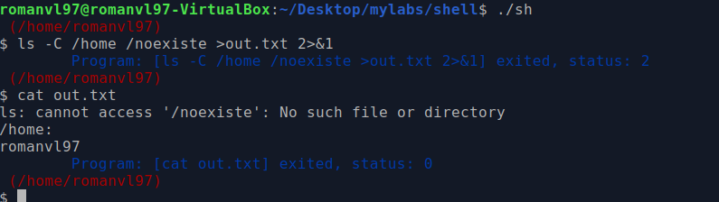
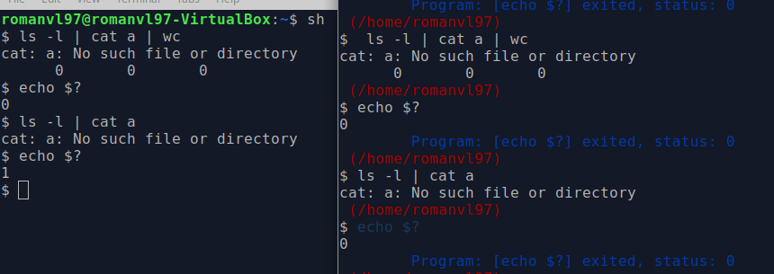
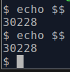
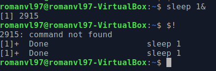
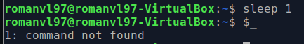

# Lab: shell

### Búsqueda en $PATH

De la documentación en *man exec* se desprende todas las siguientes conclusiones:
1. *exec* sirve para hacer referencia a toda la familia de funciones *execl*, *execlp*, *execv*, etc.
2. La funciones nombradas hacen de front-end para la *syscall* *execve(2)*, es decir que por debajo realizan la llamada.
3. La diferencia radica en las letras que siguen luego de exec: execv, execvp y execvpe permiten pasar un arreglo con argumentos; execl, execlp y execle en vez de recibir un arreglo con argumentos, reciben directamente *n* argumentos como cadena de caracteres. execle y execvpe permiten especificar el *enviroment* del programa a ejecutar. 

La llamada a *exec(3)* puede fallar, de hacerlo devuelven el valor -1 y *errno* es seteado para indicar el error. Previo a ejecutar un programa se realiza la llamada a *fork*, por lo que en caso de fallar lo haría en el proceso hijo, permitiendole a la shell seguir corriendo.

---

### Comandos built-in

**cd** debe ser un *built-in* para poder modificar el *enviroment* de la shell. De lo contrario no sería posible hacerlo, ya que un hijo no podría cambiar el directorio del padre. **pwd** por el contrario no modifica las variables de entorno, por lo que podría ser un proceso hijo, que al copiarse el entorno del padre tendría lo necesario para devolver el directorio actual. *pwd* imprime lo que sea que haya en **$PWD**. La razón de que sea *built-in* podría ser de performance o para poder agregarle funcionalidades adicionales a la ejecución del comando *pwd*.

---

### Variables de entorno adicionales

Es necesario hacerlo luego de la llamada *fork* para que las variables del proceso padre no se vean afectadas. El hijo copia las variables del padre y luego se las modifica. Los procesos hijos toman sus variables de entorno de la variable *environ* del proceso padre. Si se hiciera previo al *fork*, se estarían modificando las variables de entorno de la shell.
*setenv* agrega o modifica las variables del entorno, al llamar a una función *exec* terminada en **e** lo que ocurre es que se le indica todo el entorno, por lo que habría que pasarle el entorno actual sumado a las modificaciones. Si se pasaran solo las modificaciones (como se hace en *setenv*), se perderían las variables de entorno que se tenían anteriormente. En conclusión, con *setenv* agrego/modifico variables del entorno que ya se tenía, al hacer *exec* terminada en e se van a tener únicamente las variables que se pasen por parámetro. Si se quisiera cambiar la implementación habría que copiar las variables de entorno actuales, modificar o agregar a ese conjunto las deseadas y luego llamar a *exec* terminada en e.
---

### Procesos en segundo plano

Para la implementación de procesos en segundo plano se los identifica por la presencia del caracter *&* en la linea de comandos. Al encontrarse, se lo marca como un comando de tipo BACK. Si es así lo que se le indica al proces padre es que espere al hijo pero con el *flag* WNOHANG. Esto le permite al proceso padre hacer otras tareas mientras tanto y no quedar bloqueado. En general va acompañado del flag WUNTRACED, que indica que se debe informar el estado de los procesos parados o terminados. En resumen, si no hay un proceso hijo listo para responder al *wait* del padre, el flag WNOHANG hace que el *wait* del padre no sea bloqueante, devolviendo un 0. Junto con WUNTRACED se podría decir que el padre en vez de esperar al hijo, continúa y pregunta por su estado.

---

### Flujo estándar

2>&1 indica que se debe redireccionar el *file descriptor* 2 al 1. El equivalente sería decir que la salida de *stderr* sea por *stdout*. Si en nuestra terminal se hiciera 2>1 (sin *&*) se estaria redireccionando la salida de *stderr* al archivo con nombre 1. En el primer caso tanto el error como la salida exitosa quedan en el archivo de salida. Si invierto el orden, en el caso de **bash** primero el error sale por salida estándar, imprimiendose en pantalla y luego el resultado exitoso se escribe en el archivo indicado. En el caso de la shell no cambia el resultado, ambos casos se escriben en el archivo indicado para la salida. 

---

### Tuberías simples (pipes)

La shell no va a retornar 1 por la falla de un comando en un pipe, sino que siempre será 0. En el caso de bash, va a devolver el *exit code* del último comando ejecutado. Si se quisiera conocer el *exit code* de los comandos intermedios, posee una variable (arreglo) que permite recuperar valores llamada PIPESTATUS. 

---

### Pseudo-variables

1. $$ se expande en el PID (*process id*) de la shell corriendo.  
2. $! se expande en el PID del último proceso corrido en segundo plano   
3. $_ se expande en el ultimo argumento pasado al ultimo comando ejecutado   

---

